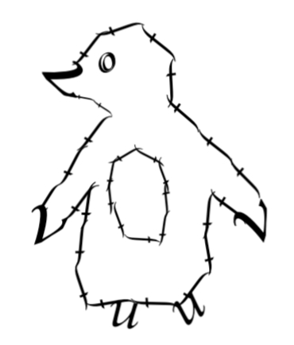

<html lang="en">
<head>
  <meta charset="utf-8" />
  <meta name="viewport" content="width=device-width,initial-scale=1" />
  <link rel="stylesheet" href="styles.css" />
</head>
<body>
  

    <header class="site-header site-header--centered">
      <h1 class="site-title">Tiago Baptista Lopes</h1>
      
Essays, notes and reflections. For no one.

    </header>

  <main class="content" role="main">
      <section class="posts" aria-labelledby="posts-heading">
        <h2 id="posts-heading" class="posts-heading">All articles</h2>

   <ul class="post-list">
          <li class="post-list-item">
            <a class="post-link" href="articles/write-for-no-one/write-for-no-one.html">Write for no one</a>
             — <time datetime="2025-02-28">February 28, 2025</time>
          </li>
          <li class="post-list-item">
            <a class="post-link" href="articles/a-taller-shade/a-taller-shade.html">A taller shade for tomorrow</a>
             — <time datetime="2025-03-30">March 30, 2025</time>
          </li>
        </ul>
      </section>
    </main>
    <footer class="site-footer">
      
© 2025 Tiago Baptista Lopes

    </footer>
    

     
    

</body>
</html>
